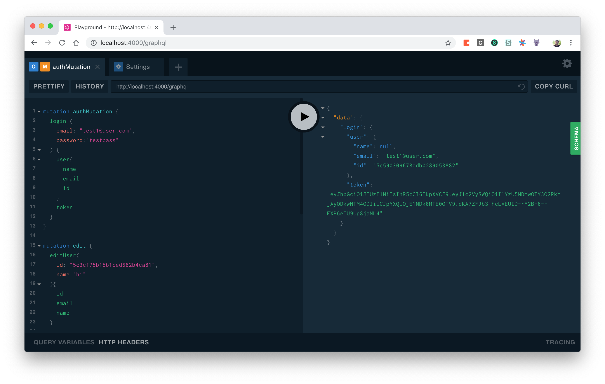

# GraphQL Auth Server

A GraphQL authentication server built with Node, Express, MongoDB, Mongoose, and Babel.

## Usage

To begin, run 

```npm install```

to install dependencies. Then, 

```npm run dev``` 

to start the server in development mode via nodemon, which restarts the server every time a change is detected. 

Finally, visit the Apollo graphql playground at http://localhost:4000/graphql.




## Technologies


| Tool                  | Usage                                                                                   | Documentation                                       |
| --------------------- | --------------------------------------------------------------------------------------- | --------------------------------------------------- |
| GraphQL               | Data transfer protocol.                                                                 | https://graphql.com                                 |
| Babel                 | Allow for ES6 syntax transpilation in a backend NodeJS server.                          | https://babel.io                                    |
| Mongoose              | ORM used to structure the single-source-of-truth data model and interface with MongoDB. | https://mongoosejs.com/                             |
| Concurrently          | Run multiple npm commands concurrently.                                                 | https://www.npmjs.com/package/concurrently          |
| Bcrypt                | Hashing and Salting passwords before storage.                                           | https://www.npmjs.com/package/bcrypt                |
| Cors                  | Modify and limit requests from various IP addresses.                                    | https://www.npmjs.com/package/cors                  |
| Apollo Graphql Server | Apollo Graphql Servler                                                                  | https://www.npmjs.com/package/apollo-server-express |
| Express               | NodeJS server                                                                           | https://expressjs.com                               |
| Morgan                | Express Logging middleware                                                              | https://github.com/expressjs/morgan                 |


## User Object
Defined as a Javascript Object and registered as a "User" class by Mongoose in `graphql/models/User.js`

```javascript
const UserSchema = new Schema({
  id: {
    type: String,
    required: true,
    unique: true
  },
  name: {
    type: String
  },
  email: {
    type: String,
    required: true
  },
  password: {
    type: String,
    required: true
  }
});
```

## Authentication 

Users can `Sign Up` or `Log in` by sending the corresponding GraphQL queries to signup 
```graphql
mutation {
  signup(
    email: "kunal@graph.cool"
    password: "graphql"
  ) {
    token
    user {
      id
      email

    }
  }
}
```

or log in with an existing email and password.

```graphql
mutation {
  login(
    email: "kunal@graph.cool"
    password: "graphql"
  ) {
    token
    user {
      id
      email

    }
  }
}
```

These requests are handled by the `signup` and `login` resolvers, which are asynchronous functions under the `User` data type. In `graphql/resolvers/User.js` under the User's `Mutation` object we have the signup resolver.

```javascript
signup: async (root, args) => {
      try {
        const id = mongoose.Types.ObjectId();
        const password = await bcrypt.hash(args.password, 10);
        const user = await new User({ id, email: args.email, password }).save();
        console.log(user);

        const token = jwt.sign({ userId: user.id }, APP_SECRET);
        // return Authpayload
        console.log(`${args.email} has been signed up.`);
        return {
          token,
          user
        };
      } catch (error) {
        console.log(`${args.email} could not sign up. Got error: ${error}`);
      }
    }
```

and the login resolver.


```javascript 
    login: async (root, { email, password }) => {
      try {
        const user = await User.findOne({ email: email }).exec();
        if (!user) {
          throw new Error("No such user found");
        }
        const valid = bcrypt.compare(password, user.password);
        if (!valid) {
          throw new Error("Invalid password");
        }
        const token = jwt.sign({ userId: user.id }, APP_SECRET);
        // return Authpayload
        console.log(`${email} has logged in.`);
        return {
          token,
          user
        };
      } catch (error) {
        console.log(`${email} could not log in. Got error: ${error}`);
      }
    }
```